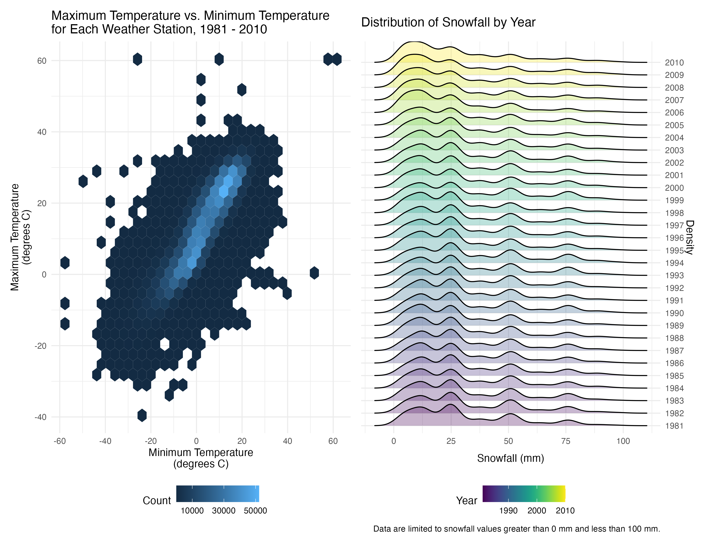

```{r setup, include = FALSE}
knitr::opts_chunk$set(
	echo = TRUE,
	message = FALSE,
	warning = FALSE
)
```

```{r}
library(tidyverse)
library(p8105.datasets)
library(ggridges)
library(patchwork)
```


# Problem 1

## Load the data

```{r}
data("instacart")
```

## Data description

The `instacart` dataset contains `r nrow(instacart)` observations of `r n_distinct(instacart$user_id)` unique users from the "train" evaluation set, with `r ncol(instacart)` variables, primarily describing information about Instacart online order usage. Some key variables in the dataset are as follows:

*   `user_id`: user identifier
*   `product_id` and `product_name`: product identifier and name of the product, respectively
*   `aisle_id` and `aisle`: aisle identifier and name of the aisle, respectively
*   `department_id` and `department`: department identifier and name of the department, respectively
*   some variables related to the `order`, such as:
    *   `order_id`: order identifier
    *   `add_to_cart_order`: sequence of each product being added into cart in each order
    *   `order_number`: order sequence for each unique user
    *   `order_dow` and `order_hour_of_day`: time that the order was placed on
    *   `days_since_prior_order`: days since the last order

To give an illustrative example of the order NO.1 in this dataset:

```{r}
instacart %>% 
  filter(order_id == 1)
```

In the "train" evaluation set, the user 112108 ordered 8 products from dairy eggs, produce, and canned goods department in this order, including Bulgarian Yogurt, Organic 4% Milk Fat Whole Milk Cottage Cheese, Organic Celery Hearts, Cucumber Kirby, Lightly Smoked Sardines in Olive Oil, Bag of Organic Bananas, Organic Hass Avocado, and Organic Whole String Cheese. The user 112108 placed this order on Wednesday, 10 am, and this order is the 4th one for this user. The prior order of the user 112108 was placed 9 days ago.


## Some Questions Related to `instacart`

*   How many aisles are there, and which aisles are the most items ordered from?

```{r}
instacart %>% 
  group_by(aisle) %>% 
  summarise(
    order_count = n()
  ) %>% 
  arrange(desc(order_count)) %>% 
  head(2)
```

There are `r n_distinct(instacart$aisle)` unique aisles, and the most items are ordered from aisle "fresh vegetables", followed by aisle "fresh fruits".

*   Make a plot that shows the number of items ordered in each aisle, limiting this to aisles with more than 10000 items ordered. Arrange aisles sensibly, and organize your plot so others can read it.

```{r, fig.height = 6, out.width = "90%"}
instacart %>% 
  group_by(aisle) %>% 
  summarise(
    order_count = n()
  ) %>% 
  filter(order_count > 10000) %>% 
  mutate(
    aisle = fct_reorder(aisle, order_count)
  ) %>% 
  ggplot(aes(x = aisle, y = order_count)) +
  geom_col() +
  labs(
      x = "Aisle",
      y = "Number of Items Ordered in Each Aisle",
      title = "Frequency of Items Ordered in Each Aisle",
      caption = "Data are limited to aisles with more than 10,000 items ordered."
    ) +
  coord_flip() +
  theme_bw() +
  theme(
    panel.grid.major = element_blank(),
    panel.grid.minor = element_blank()
    )
```

The plot above shows the number of items ordered in each aisle, with data limited to aisles with more than 10000 items ordered. We can tell that the most items are ordered from aisle "fresh vegetables", followed by aisle "fresh fruits".

*   Make a table showing the three most popular items in each of the aisles “baking ingredients”, “dog food care”, and “packaged vegetables fruits”. Include the number of times each item is ordered in your table.

```{r}
instacart %>% 
  filter(
    aisle %in% c("baking ingredients", "dog food care", "packaged vegetables fruits")
    ) %>% 
  group_by(product_name) %>% 
  mutate(
    times = n()
  ) %>% 
  relocate(aisle) %>% 
  arrange(aisle, desc(times)) %>% 
  distinct(aisle, product_name, times) %>%
  group_by(aisle) %>% 
  top_n(n = 3)
```

The table above shows the three most popular items in each of the aisles “baking ingredients”, “dog food care”, and “packaged vegetables fruits”.

Of the aisle "baking ingredients", the most popular item is Light Brown Sugar, followed by Pure Baking Soda and Cane Sugar. Of the aisle "dog food care", the most popular item is Snack Sticks Chicken & Rice Recipe Dog Treats, followed by Organix Chicken & Brown Rice Recipe and Small Dog Biscuits. Of the aisle "packaged vegetables fruits", the most popular item is Organic Baby Spinach, followed by Organic Raspberries and Organic Blueberries. 

*   Make a table showing the mean hour of the day at which Pink Lady Apples and Coffee Ice Cream are ordered on each day of the week; format this table for human readers (i.e. produce a 2 x 7 table).

```{r}
instacart %>% 
  filter(
    product_name %in% c("Pink Lady Apples", "Coffee Ice Cream")
    ) %>% 
  group_by(product_name, order_dow) %>% 
  summarise(
    mean_hour = mean(order_hour_of_day, na.rm = TRUE)
  ) %>% 
  mutate(
    order_dow = order_dow + 1,
    order_dow = lubridate::wday(order_dow, label = TRUE, abbr = FALSE)
  ) %>%
  pivot_wider(
    names_from = order_dow,
    values_from = mean_hour
  )
```

The table above shows the mean hour of the day at which Pink Lady Apples and Coffee Ice Cream are ordered on each day of the week. To give an illustrative example, the mean hour of Pink Lady Apples being ordered on Sunday is 13.4.


# Problem 2

## Load, tidy, and wrangle the data

The following code chunk is to tidy the data by `pivot_longer()`, create a new variable called `weekday_vs_weekend` to indicate whether the day is weekday or weekend, and finally encode some variables (`day` and `minute`) into more reasonable classes. The resulting tidied dataset is arranged by `week` and `day`.

```{r}
accelerometer = read_csv("data/accel_data.csv") %>% 
  janitor::clean_names() %>% 
  pivot_longer(
    activity_1:activity_1440,
    names_to = "minute",
    values_to = "activity_counts",
    names_prefix = "activity_"
  ) %>% 
  mutate(
    day = factor(day, 
                 levels = c("Sunday", "Monday", "Tuesday", "Wednesday",
                            "Thursday", "Friday", "Saturday")),
    weekday_vs_weekend = ifelse(day %in%  c("Saturday", "Sunday"), "weekend", "weekday"),
    minute = as.numeric(minute)
  ) %>% 
  arrange(week, day)
```

The resulting dataset includes `r nrow(accelerometer)` observations with `r ncol(accelerometer)` variables, primarily recording some activity information of a 63 year-old male with BMI 25, collected by the accelerometer. Some key variables are `activity_counts`, indicating the activity counts for each minute; `week`, `day`, `minute`, showing the time of which the data point is collected; and `weekday_vs_weekend` is a binary indicator of either weekday or weekend.

## Traditional analyses of `accelerometer`

The following code chunk creates a new variable `total_counts` by aggregating across minutes to identify the total activity for each day. The table below shows the total activity counts by `week` and `day`.

```{r}
accelerometer = accelerometer %>% 
  group_by(day_id) %>% 
  mutate(
    total_counts = sum(activity_counts, na.rm = TRUE)
  )

accelerometer %>% 
  distinct(week, day, total_counts) %>% 
  print.data.frame()
```

To examine any apparent trends of total activity, we'd like to make a scatterplot with a trend line added.

```{r}
accelerometer %>% 
  ggplot(aes(x = day_id, y = total_counts, color = weekday_vs_weekend)) +
  geom_point() +
  geom_smooth(se = FALSE) +
  labs(
    x = "Day ID",
    y = "Total Activity Counts",
    title = "Total Activity Counts by Day ID",
    caption = "Day ID is the originally assigned ID by the accelerometer."    
  ) +
  theme_minimal() +
  theme(
    legend.position = "bottom",
    legend.title = element_blank()
  )
```

As the above figure shows, the total activity counts on weekdays seem to be more stable, while there are more fluctuations (larger variances) on weekends. However, we should note that there are several days with total activity counts as low as 1440 (with every minute only counting "1"), indicating that the accelerometer might fail to accurately record the data during those days.

## Inspection activity over the course of the day

The following code chunk makes a single-panel plot showing the 24-hour activity time courses for each day.

```{r, fig.height = 6, out.width = "90%"}
accelerometer %>%
  mutate(
    hour = minute / 60
  ) %>% 
  ggplot(aes(x = hour, y = activity_counts, color = day)) +
  geom_line(alpha = .3) +
  geom_smooth(se = FALSE) +
  labs(
    x = "Hour of Day",
    y = "Activity Counts",
    title = "24-hour Activity Counts for Each Day",
    color = "Day of Week"
  ) +
  viridis::scale_color_viridis(
    discrete = TRUE
  ) +
  scale_x_continuous(
    breaks = c(0, 3, 6, 9, 12, 15, 18, 21, 24)
  ) +
  theme_minimal()
```

The plot above shows the 24-hour activity counts by hour for each day, and different colors are used to indicate day of the week. We can tell that in the evening of most of the days and on Sunday noon, the activity counts of this participant are greater than usual, compared to other time courses. From the smooth line, we can tell that the activity counts tend to experience a decline after about 9 pm each day, and there are always periods with lower activity counts from 0 to 5 am each day.


# Problem 3

## Load and clean the data

Load the data, separate `date` into `year`, `month`, and `day`. Change the units of temperature and precipitation into more reasonable and readable ones.

```{r}
data("ny_noaa")

ny_noaa = ny_noaa %>%
  separate(date, into = c("year", "month", "day"), sep = "-") %>% 
  mutate(
    year = as.numeric(year),
    month = as.numeric(month),
    day = as.numeric(day),
    prcp = ifelse(!is.na(prcp), prcp / 10, NA_real_),
    tmax = ifelse(!is.na(tmax), as.numeric(tmax) / 10, NA_real_),
    tmin = ifelse(!is.na(tmin), as.numeric(tmin) / 10, NA_real_)
  )
```

## Data description

The `ny_noaa` dataset contains `r nrow(ny_noaa)` observations of `r n_distinct(ny_noaa$id)` unique weather stations in New York State, with `r ncol(ny_noaa)` variables, primarily describing climate information collected at given specific observation dates from `r min(ny_noaa$year)` to `r max(ny_noaa$year)`. Some key variables are recorded in the dataset, such as precipitation (mm), snowfall (mm), snow depth (mm), maximum and minimum temperature (degrees C). There are `r sum(is.na(ny_noaa$prcp))` missing values for precipitation, `r sum(is.na(ny_noaa$snow))` missing values for snowfall, `r sum(is.na(ny_noaa$snwd))` missing values for snow depth, `r sum(is.na(ny_noaa$tmax))` missing values for maximum temperature, and `r sum(is.na(ny_noaa$tmin))` missing values for minimum temperature. These missing values are due to the fact that each weather station may collect only a subset of these variables.

```{r}
ny_noaa %>% 
  group_by(snow) %>% 
  summarise(
    n_obs = n()
  ) %>% 
  arrange(desc(n_obs)) %>% 
  head()
```

For snowfall, the most commonly observed value is 0. It's reasonable since the snow usually and only occurs during winter months, which only take up 1/4 time of a whole year.

## Two-panel plot for average `tmax`

The following code chunk makes a two-panel plot showing the average max temperature in January and July in each weather station across years.

```{r}
ny_noaa %>% 
  filter(month %in% c(1, 7)) %>% 
  mutate(
    month = month.name[month]
  ) %>% 
  group_by(id, year, month) %>% 
  summarise(
    mean_tmax = mean(tmax, na.rm = TRUE)
  ) %>% 
  ggplot(aes(x = year, y = mean_tmax)) +
  geom_point() +
  geom_smooth(se = FALSE) +
  labs(
    x = "Year",
    y = "Average Maximum Temperature\n(degrees C)",
    title = "Average Maximum Temperature in Each Weather Station across Years",
    caption = "Data are limited to January and July.\nEach spot represent a unique weather station."
  ) +
  scale_x_continuous(
    n.breaks = 6
  ) +
  facet_grid(. ~ month) +
  theme_minimal() +
  theme(
    panel.spacing = unit(1, "lines")
  )
```

The average maximum temperature in January is obviously lower than than that in July, as expected.

For average maximum temperature in **January**, there is a continuous increase from 1981 to 1990. However, after 1990, it tends to have a regular fluctuation at around 0 degree C, with a decrease lasting for 3 to 4 years followed by a continuous increase for approximately 4 to 5 years. There are some obvious outliers just by eyeballing, for instance, in 1982, 1993, and 2005, we can observe some stations with extremely lower mean maximum temperature (and also some in 2008 and 2010), while in 2004, there are some higher observations.

For average maximum temperature in **July**, the overall trend is more stable. The average maximum temperature is always at around 27 degrees C across years. There are some obvious outliers, for instance, in 1988, we can observe a weather station with an extremely lower average maximum temperature, and also some lower observations in years such as 1981 to 1984, 2004, and 2007.

## Two-panel plot summarizing temperature and snowfall

First, make a plot showing `tmax` vs `tmin` for the full dataset.

```{r}
tmax_vs_tmin = ny_noaa %>% 
  ggplot(aes(x = tmin, y = tmax)) +
  geom_hex() +
  labs(
    x = "Minimum Temperature\n(degrees C)",
    y = "Maximum Temperature\n(degrees C)",
    fill = "Count",
    title = "Maximum Temperature vs. Minimum Temperature\nfor Each Weather Station, 1981 - 2010"
  ) +
  scale_x_continuous(
    n.breaks = 6
  ) +
  scale_fill_continuous(
    breaks = c(10000, 30000, 50000)
  ) +
  theme_minimal() +
  theme(
    legend.position = "bottom"
  )
```

Then, make a plot showing the distribution of snowfall values greater than 0 and less than 100 separately by year.

```{r}
snowfall_density_ridges = ny_noaa %>% 
  filter(snow %in% (1:99)) %>% 
  ggplot(aes(x = snow, y = as.factor(year), fill = year)) +
  geom_density_ridges(alpha = .3) +
  labs(
    x = "Snowfall (mm)",
    y = "Density",
    fill = "Year",
    title = "Distribution of Snowfall by Year",
    caption = "Data are limited to snowfall values greater than 0 mm and less than 100 mm."
  ) +
  scale_x_continuous(
    breaks = c(0, 25, 50, 75, 100)
  ) +
  scale_y_discrete(
    position = "right"
  ) +
  viridis::scale_fill_viridis() +
  theme_minimal() +
  theme(
    legend.position = "bottom"
  )
```

Finally, use `patchwork` to align these two plots side by side. Save it by `ggsave()` and attach it in the final rendered github_document.

```{r}
final_plot = tmax_vs_tmin + snowfall_density_ridges

ggsave(
  filename = "results/final_plot.png", 
  plot = final_plot, 
  width = 26, 
  height = 20, 
  units = "cm"
)


```

The final plot shows both the `tmax` vs. `tmin` for the whole dataset from 1981 to 2010 and the distribution of snowfall values between 0 mm and 100 mm.

We can tell that a large proportion of observations lies within the range of -10 degrees C to 30 degrees C, with some obvious outliers with extremely higher temperatures, especially on the right corner and the top part of the hexagonal plot.

For the density ridges of snowfall values, there is always a peak at around 12 mm. However, compared to the earlier years, the peaks at higher snowfall values (e.g., 25 mm, 50 mm, etc.) become less obvious, indicating less heavy snowfalls in more recent years. This may be consistent with the underlying global warming trend.
