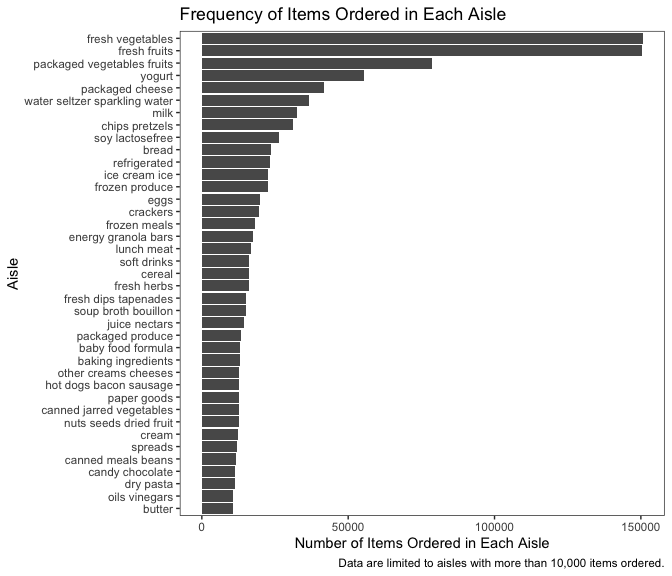

P8105 Homework 3
================
Siyue Gao
2022-10-09

``` r
library(tidyverse)
library(p8105.datasets)
```

# Problem 1

## Load the data

``` r
data("instacart")
```

## Data Description

The `instacart` dataset contains 1384617 observations of 131209 unique
users from the “train” evaluation set, with 15 variables, primarily
describing information about Instacart online order usage. Some key
variables in the dataset are as follows:

-   `user_id`: user identifier
-   `product_id` and `product_name`: product identifier and name of the
    product, respectively
-   `aisle_id` and `aisle`: aisle identifier and name of the aisle,
    respectively
-   `department_id` and `department`: department identifier and name of
    the department, respectively
-   some variables related to the `order`, such as:
    -   `order_id`: order identifier
    -   `add_to_cart_order`: sequence of each product being added into
        cart in each order
    -   `order_number`: order sequence for each unique user
    -   `order_dow` and `order_hour_of_day`: time that the order was
        placed on
    -   `days_since_prior_order`: days since the last order

To give an illustrative example of the order NO.1 in this dataset:

``` r
instacart %>% 
  filter(order_id == 1)
```

    ## # A tibble: 8 × 15
    ##   order_id product_id add_to_c…¹ reord…² user_id eval_…³ order…⁴ order…⁵ order…⁶
    ##      <int>      <int>      <int>   <int>   <int> <chr>     <int>   <int>   <int>
    ## 1        1      49302          1       1  112108 train         4       4      10
    ## 2        1      11109          2       1  112108 train         4       4      10
    ## 3        1      10246          3       0  112108 train         4       4      10
    ## 4        1      49683          4       0  112108 train         4       4      10
    ## 5        1      43633          5       1  112108 train         4       4      10
    ## 6        1      13176          6       0  112108 train         4       4      10
    ## 7        1      47209          7       0  112108 train         4       4      10
    ## 8        1      22035          8       1  112108 train         4       4      10
    ## # … with 6 more variables: days_since_prior_order <int>, product_name <chr>,
    ## #   aisle_id <int>, department_id <int>, aisle <chr>, department <chr>, and
    ## #   abbreviated variable names ¹​add_to_cart_order, ²​reordered, ³​eval_set,
    ## #   ⁴​order_number, ⁵​order_dow, ⁶​order_hour_of_day

In the “train” evaluation set, the user 112108 ordered 8 products from
dairy eggs, produce, and canned goods department in this order,
including Bulgarian Yogurt, Organic 4% Milk Fat Whole Milk Cottage
Cheese, Organic Celery Hearts, Cucumber Kirby, Lightly Smoked Sardines
in Olive Oil, Bag of Organic Bananas, Organic Hass Avocado, and Organic
Whole String Cheese. The user 112108 placed this order on Wednesday, 10
am, and this order is the 4th one for this user. The prior order of the
user 112108 was placed 9 days ago.

## Some Questions Related to `instacart`

-   How many aisles are there, and which aisles are the most items
    ordered from?

``` r
instacart %>% 
  group_by(aisle) %>% 
  summarise(
    order_count = n()
  ) %>% 
  arrange(desc(order_count)) %>% 
  head(2)
```

    ## # A tibble: 2 × 2
    ##   aisle            order_count
    ##   <chr>                  <int>
    ## 1 fresh vegetables      150609
    ## 2 fresh fruits          150473

There are 134 unique aisles, and the most items are ordered from aisle
“fresh vegetables”, followed by aisle “fresh fruits”.

-   Make a plot that shows the number of items ordered in each aisle,
    limiting this to aisles with more than 10000 items ordered. Arrange
    aisles sensibly, and organize your plot so others can read it.

``` r
instacart %>% 
  group_by(aisle) %>% 
  summarise(
    order_count = n()
  ) %>% 
  filter(order_count > 10000) %>% 
  ggplot(aes(x = reorder(aisle, desc(order_count)), y = order_count)) +
  geom_col() +
  labs(
      x = "Aisle",
      y = "Number of Items Ordered\nin Each Aisle",
      title = "Figure 1: Frequency of Items Ordered in Each Aisle",
      caption = "Data are limited to aisles with more than 10,000 items ordered."
    ) +
  theme_bw() +
  theme(
    panel.grid.major = element_blank(),
    panel.grid.minor = element_blank(),
    axis.text.x = element_text(angle = 90),
    plot.title = element_text(hjust = 0.5)
    )
```



The plot above shows the number of items ordered in each aisle, with
data limited to aisles with more than 10000 items ordered. We can tell
that the most items are ordered from aisle “fresh vegetables”, followed
by aisle “fresh fruits”.

-   Make a table showing the three most popular items in each of the
    aisles “baking ingredients”, “dog food care”, and “packaged
    vegetables fruits”. Include the number of times each item is ordered
    in your table.

``` r
instacart %>% 
  filter(
    aisle %in% c("baking ingredients", "dog food care", "packaged vegetables fruits")
    ) %>% 
  group_by(product_name) %>% 
  mutate(
    times = n()
  ) %>% 
  relocate(aisle) %>% 
  arrange(aisle, desc(times)) %>% 
  distinct(aisle, product_name, times) %>%
  group_by(aisle) %>% 
  top_n(n = 3)
```

    ## # A tibble: 9 × 3
    ## # Groups:   aisle [3]
    ##   aisle                      product_name                                  times
    ##   <chr>                      <chr>                                         <int>
    ## 1 baking ingredients         Light Brown Sugar                               499
    ## 2 baking ingredients         Pure Baking Soda                                387
    ## 3 baking ingredients         Cane Sugar                                      336
    ## 4 dog food care              Snack Sticks Chicken & Rice Recipe Dog Treats    30
    ## 5 dog food care              Organix Chicken & Brown Rice Recipe              28
    ## 6 dog food care              Small Dog Biscuits                               26
    ## 7 packaged vegetables fruits Organic Baby Spinach                           9784
    ## 8 packaged vegetables fruits Organic Raspberries                            5546
    ## 9 packaged vegetables fruits Organic Blueberries                            4966

The table above shows the three most popular items in each of the aisles
“baking ingredients”, “dog food care”, and “packaged vegetables fruits”.

Of the aisle “baking ingredients”, the most popular item is Light Brown
Sugar, followed by Pure Baking Soda and Cane Sugar. Of the aisle “dog
food care”, the most popular item is Snack Sticks Chicken & Rice Recipe
Dog Treats, followed by Organix Chicken & Brown Rice Recipe and Small
Dog Biscuits. Of the aisle “packaged vegetables fruits”, the most
popular item is Organic Baby Spinach, followed by Organic Raspberries
and Organic Blueberries.

-   Make a table showing the mean hour of the day at which Pink Lady
    Apples and Coffee Ice Cream are ordered on each day of the week;
    format this table for human readers (i.e. produce a 2 x 7 table).

``` r
instacart %>% 
  filter(
    product_name %in% c("Pink Lady Apples", "Coffee Ice Cream")
    ) %>% 
  group_by(product_name, order_dow) %>% 
  summarise(
    mean_hour = mean(order_hour_of_day, na.rm = TRUE)
  ) %>% 
  mutate(
    order_dow = ifelse(order_dow == 0, order_dow + 7, order_dow),
    order_dow = lubridate::wday(order_dow, label = TRUE, abbr = FALSE)
  ) %>%
  pivot_wider(
    names_from = "order_dow",
    values_from = "mean_hour"
  )
```

    ## # A tibble: 2 × 8
    ## # Groups:   product_name [2]
    ##   product_name     Saturday Sunday Monday Tuesday Wednesday Thursday Friday
    ##   <chr>               <dbl>  <dbl>  <dbl>   <dbl>     <dbl>    <dbl>  <dbl>
    ## 1 Coffee Ice Cream     13.8   14.3   15.4    15.3      15.2     12.3   13.8
    ## 2 Pink Lady Apples     13.4   11.4   11.7    14.2      11.6     12.8   11.9

The table above shows the mean hour of the day at which Pink Lady Apples
and Coffee Ice Cream are ordered on each day of the week. To give an
illustrative example, the mean hour of Pink Lady Apples being ordered on
Saturday is 13.4.

# Problem 2

## Load, tidy, and wrangle the data

The following code chunk is to tidy the data by `pivot_longer()`, create
a new variable called `weekday_vs_weekend` to indicate whether the day
is weekday or weekend, and finally encode some variables (`day` and
`minute`) into more reasonable classes. The resulting tidied dataset is
arranged by `week` and `day`.

``` r
accelerometer = read_csv("data/accel_data.csv") %>% 
  janitor::clean_names() %>% 
  pivot_longer(
    activity_1:activity_1440,
    names_to = "minute",
    values_to = "activity_counts",
    names_prefix = "activity_"
  ) %>% 
  mutate(
    day = factor(day, levels = c("Sunday", "Monday", "Tuesday", "Wednesday", "Thursday", "Friday", "Saturday")),
    weekday_vs_weekend = ifelse(day %in%  c("Saturday", "Sunday"), "weekend", "weekday"),
    minute = as.numeric(minute)
  ) %>% 
  arrange(week, day)
```

The resulting dataset includes 50400 observations with 6 variables,
primarily recording some activity information of a 63 year-old male with
BMI 25, collected by the accelerometer. Some key variables are
`activity_counts`, indicating the activity counts for each minute;
`week`, `day`, `minute`, showing the time of which the data point is
collected; and `weekday_vs_weekend` is a binary indicator of either
weekday or weekend.
